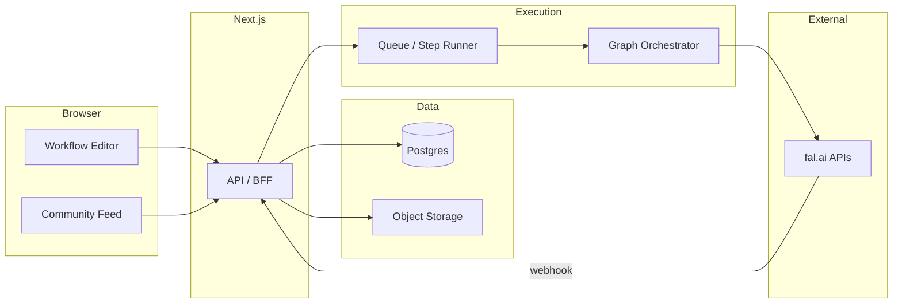

# MVP architecture: fal.ai workflow community

## Goals (test MVP — no subscriptions)

- **Studio:** Visual graph editor (n8n-style nodes/edges) where each node maps to a **fal.ai model** (or small built-in transforms: resize, merge outputs).
- **Runtime:** Execute graphs **asynchronously** (queue + webhooks), persist **runs** and **artifacts** (URLs from fal).
- **Community:** Publish workflows as **templates**; **remix** = fork graph + optionally swap inputs; **likes** (and simple **share** links); discovery feed.
- **Test phase:** **No Stripe, no credits UI, no paid tiers.** You still pay fal from **your server-side API key**, so protect yourself with **guardrails** (see below). Add subscriptions in a later phase once flows are stable.

This is a new repo ([carrot_parrot_community](file:///Users/roman/Desktop/carrot_parrot_community)) with no existing code; you can choose stack below as defaults and adjust later.

---

## Recommended MVP stack (pragmatic)

| Layer     | Choice                                              | Why                                                                      |
| --------- | --------------------------------------------------- | ------------------------------------------------------------------------ |
| App + API | **Next.js** (App Router)                            | One deployable, SSR for marketing, API routes or Route Handlers for BFF. |
| DB + Auth | **Supabase** (Postgres + Auth) or **Clerk + Neon**  | Fast MVP: RLS for workflows; Postgres for relational data.               |
| Canvas    | **React Flow** (or **XYFlow**)                      | Battle-tested for node editors; fits your reference UIs.                 |
| Jobs      | **Inngest**, **Trigger.dev**, or **BullMQ + Redis** | Long-running DAG execution, retries, visibility; fal is async.           |
| Storage   | **S3/R2** for uploads; fal URLs for outputs         | Keep blobs out of DB; store metadata + signed URLs if needed.            |
| Payments  | **Deferred**                                        | Add **Stripe** when moving from test to production monetization.         |

**Avoid** running fal calls directly in HTTP request/response: fal jobs can take minutes; always return `runId` and poll or use **webhooks**.

---

## Core architecture (logical)

---

## Domain model (minimum entities)

- **User** — id, auth fields; **no subscription/credit fields** in test MVP (optional: `isAdmin`, `dailyRunCount` for limits).
- **Workflow** — graph JSON: nodes `{ id, type, falModelId?, params, position }`, edges `{ source, target, sourceHandle?, targetHandle? }`, visibility (`private` | `published`).
- **WorkflowVersion** (optional but useful) — immutable snapshot at publish/remix time so remixes do not break when author edits.
- **Run** — `workflowId`, `status`, `startedAt`, `finishedAt`, `error`, `triggeredByUserId`; optional **estimatedUsd** or **fal request ids** for your own cost monitoring (not shown to users as “credits” yet).
- **RunStep** — per-node: inputs snapshot, fal request id, output refs, status (maps to observability; later used for refunds).
- **Social** — `Like(workflowId, userId)`, `Remix(parentWorkflowId → childWorkflowId)`; **Share** can be a public slug (`/w/{slug}`) without extra tables.

Store **workflow definition** as JSON (validated with Zod); validate **fal model IDs** and **allowed params** server-side against an allowlist so users cannot arbitrary-call arbitrary endpoints in your name.

---

## Execution pipeline (fal under the hood)

1. **Validate graph** — DAG (no cycles unless you explicitly support loops later), typed ports (image vs text vs video), all required inputs satisfied (uploads or upstream nodes).
2. **Guardrails (test phase, no billing)** — e.g. **max runs per user per day**, **max concurrent runs**, **max nodes per graph**, optional **allowlist of emails** if the app is invite-only. Reject before enqueueing fal work.
3. **Topological sort** — execute nodes in order; pass outputs along edges.
4. **Per node:** enqueue fal call with `webhookUrl` (your API) + store **fal request id** on `RunStep`.
5. **Webhook handler:** resolve `RunStep`, persist outputs (URLs), mark step complete, enqueue **next** ready nodes or fail run.
6. **Idempotency** — webhook delivery can repeat; use idempotency keys on `RunStep` completion.

Optional: log **fal usage** (request id, model id, timestamps) to estimate spend; still no user-facing credits.

**Secrets:** fal API key **only on server**; never in the browser. **User keys** for BYOK can be a post-MVP.

---

## Why this is “easier than fal.ai workflows” (product, not only tech)

- **Opinionated node library** — only models you curate, with **simplified forms** (hide advanced params) and **sensible defaults**.
- **Templates + remix** — start from a working graph; change one node or prompt.
- **Unified asset pipeline** — uploads and outputs appear in one place; no raw JSON juggling.
- **One-click run** for the whole graph vs manual wiring in power-user tools.

---

## Community: MVP scope

- **Publish** — workflow becomes public; optional title, description, cover image (from last run or upload).
- **Feed** — sort by **recent** or **trending** (likes in last 7 days); pagination.
- **Remix** — duplicate `WorkflowVersion` into a new `Workflow` owned by remixer; link `parentWorkflowId`.
- **Likes** — unique per user; optional **share** = copy link.

**Moderation (MVP):** report button + manual review; block public publish until you whitelist or scan metadata (post-MVP).

---

## Test phase: cost control without subscriptions ($1–2 inference risk)

You are not charging users yet, but **fal still bills you** per call. For the test version:

- **Hard limits** — per-user daily run cap, max graph size, max concurrent runs; tune in env/config.
- **Invite-only or small beta** — optional email allowlist so strangers cannot burn your key.
- **Observability** — store model id + request id per `RunStep`; periodically reconcile against fal dashboard / exports.
- **No “unlimited” messaging** — even in test, show a simple “Daily runs remaining: N” if you implement a counter.

**Later (production):** replace guardrails with **credits + Stripe** using the same `Run` / `RunStep` data (see deferred section).

---

## Phased delivery (suggested order)

1. **Auth + empty canvas + save workflow JSON** (no fal).
2. **Single-node run** to fal (one model end-to-end + webhook + guardrails).
3. **Multi-node linear DAG** (no branching).
4. **Branching + publish/remix** + feed + likes.
5. **Deferred:** **Subscriptions + credit packs + Stripe** (when exiting test).

---

## What to defer (post-test MVP)

- **Stripe, credits UI, subscription tiers**
- Real-time **collaborative** editing (Yjs) — costly; start single-user.
- **Full ComfyUI-level** expressiveness — conflicts with “simple” positioning.
- **BYOK** — simplifies your margin but adds support burden.
- **Dynamic pricing from fal** — add when catalog is stable.

---

## Key risks

- **Webhook reliability** — retries, dead-letter queue, manual “reconcile run” admin tool.
- **Runaway fal spend in test** — mitigate with caps + invite-only; **never** ship a public URL without limits.
- **Legal** — ToS for user-generated content and generated media; age/region rules when you add payments.

---

## Summary

Ship a **Next.js BFF + Postgres + async job runner** that executes a **validated DAG** via **fal.ai + webhooks**, with **server-side guardrails** instead of billing for the first version. Layer **community** (publish, remix, likes, share) on top. **Subscriptions and credits** come later, reusing the same run/step model for metering and refunds.