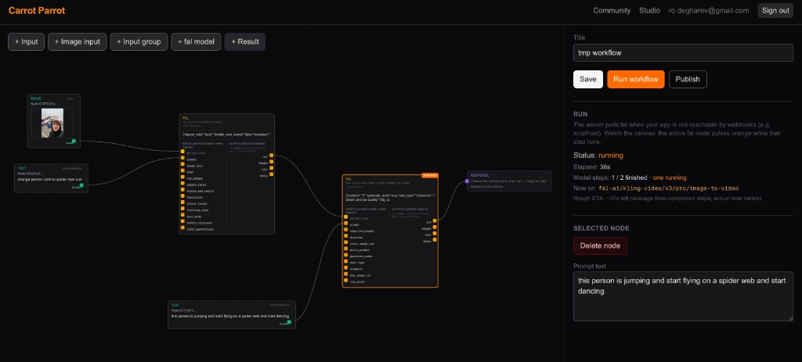
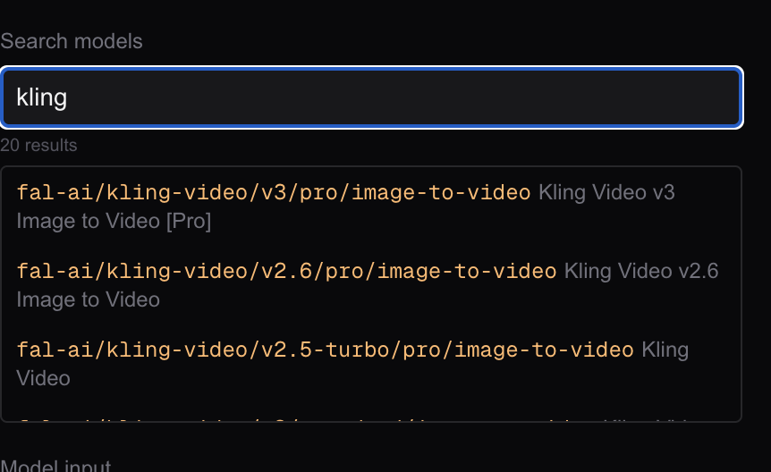
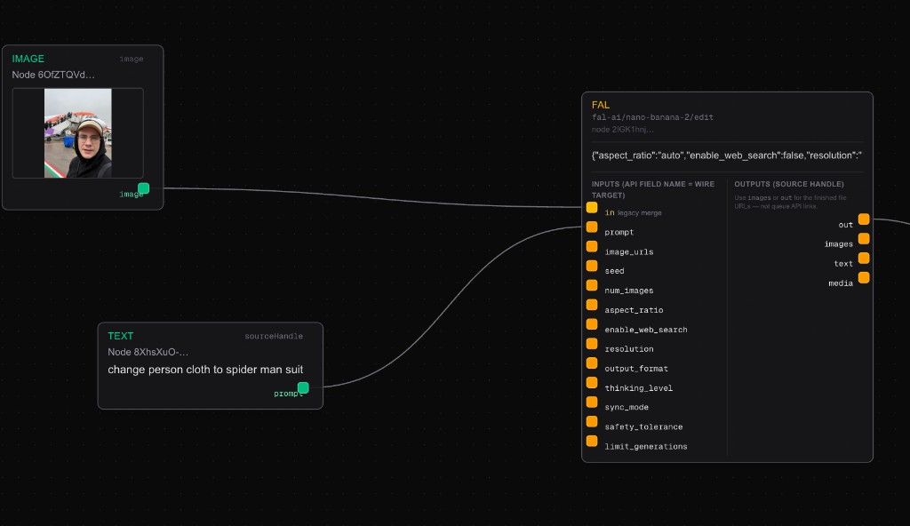

# Carrot Parrot Community

Visual **AI workflow** editor built with [Next.js](https://nextjs.org): compose node graphs backed by [fal.ai](https://fal.ai) models, run them asynchronously via webhooks, then **publish**, **remix**, and **like** workflows in a simple community feed.

## Screenshots

### Studio — multi-step workflow and run status

Build chains of inputs, fal model nodes, and a response node. The sidebar shows run progress, current model (for example `fal-ai/kling-video/v3/pro/image-to-video`), and ETA while steps execute.



### Model search

Search models by keyword; results list the fal endpoint path and display name so you can paste the model into a node.



### Wiring image + prompt to a model

Connect an **IMAGE** node and **TEXT** node to a **FAL** node; map each wire to the model’s **named** inputs (here `fal-ai/nano-banana-2/edit` with `prompt` plus image fields such as `image_urls`).



### VLM / LLM text into the next model’s `prompt`

Models such as [`openrouter/router/vision`](https://fal.ai/models/openrouter/router/vision) require **`image_urls`** (array of URLs) for frame input—wire **`pick_image`** / **`extract_frames`** **`out`** to the vision node’s **`image_urls`** handle (not `image_url`). The API returns a JSON object with an `output` string (caption), not image URLs. In this studio, each fal node exposes a single **`out`** port typed as **text + media URLs**: connect **`out`** to the next node’s **`prompt`** (or **`start_image_url`**, etc.) by attaching to that input’s handle. The runner stores captions in artifacts so **`prompt`** wires get plain text.

**Marketing remix** (programmatic graph from `buildMarketingRemixLanesGraph` / remix from video): optical-flow **`extract_keyframes`** → **`pick_image`** per lane → OpenRouter vision → **`review_gate`** (pause) → **`fal-ai/nano-banana-2`** text-to-image → per-lane **`images_to_video`** (short static clip) → **`concat_videos`** → **`mux_audio_video`**. For motion, replace a lane’s **`images_to_video`** node with **`fal-ai/kling-video/.../image-to-video`**, wire **`nano_*` `out`** → **`start_image_url`**, and optionally add a motion-caption step before Kling.

### Frames → video

**`mux_audio_video`** always expects a **video URL** on `video_url` and **audio** on `audio_url` ([`mux_audio_video`](src/lib/media-process-runner.ts)). It does not assemble a frame sequence into video; use one of the paths below.

- **Path A — Slideshow (server-side ffmpeg)**: Nodes that output **image URLs** (`extract_frames`, `fal-ai/nano-banana-2/edit`, or **input_group** slots) → **`media_process`** **`images_to_video`** (wire **`out`** → **`image_urls`**). Params: **`secondsPerFrame`**, optional **`maxFrames`** cap, optional **`maxWidth`**. Output is one MP4; connect that to **`mux_audio_video`** `video_url` with **`extract_audio`** on `audio_url`.
- **Path B — Nanobanana + fal image-to-video**: **`nano-banana` `out`** → **`start_image_url`** on Kling (or similar) → **`mux_audio_video`** `video_url` ← generated video, **`extract_audio`** → `audio_url`. The merge step uses the **first** image URL for single-URL fields like `start_image_url` ([`mergeFalInput`](src/lib/fal-merge-input.ts)).
- **Path C — Original video + audio**: **`input_video`** (or any upstream **video** artifact) → **`mux_audio_video`** `video_url`, **`extract_audio`** → `audio_url`.

Example graph (slideshow branch): [`src/lib/templates/replicate-marketing-slideshow.json`](src/lib/templates/replicate-marketing-slideshow.json). The Kling marketing template is still [`replicate-marketing-ad.json`](src/lib/templates/replicate-marketing-ad.json).

## Features

- **Studio** — XYFlow-based graph editor; nodes map to fal models (metadata from `/api/models`).
- **Runs** — DAG execution with persisted steps and artifacts; completion handled via `/api/webhooks/fal`.
- **Community** — Publish workflows, public pages at `/w/[slug]`, discovery feed, likes, remix (fork).

## Stack

- Next.js (App Router), React 19, TypeScript, Tailwind CSS  
- Prisma + SQLite (default local DB)  
- Auth.js (NextAuth v5) with credentials registration  
- `@fal-ai/client` for queue/subscribe runs  

## Prerequisites

- Node.js 20+  
- A [fal.ai](https://fal.ai) API key per user (saved after sign-up, encrypted with `AUTH_SECRET`) or an optional operator key `FAL_KEY` for dev / shared billing  
- For local webhooks, a publicly reachable `NEXT_PUBLIC_APP_URL` (e.g. [ngrok](https://ngrok.com) or similar) so fal can POST back to your machine  
- **FFmpeg** — `ffmpeg` and `ffprobe` on the server `PATH` for `media_process` nodes (extract audio/frames, concat, mux, **images → MP4 slideshow**, scene helpers). Outputs upload via fal storage; large videos may need long timeouts or a background worker instead of a serverless request. **`concat_videos`** re-encodes every segment (caps width at 1280px, CFR 24 fps, strips audio) before joining, so you can mix fal image-to-video clips with server **`images_to_video`** slideshows without stream-copy failures from mismatched FPS, resolution, or audio.
- **Marketing “create from video”** — `/studio/create` uses demo clips from `public/marketing-ads/` (copied from the repo’s `marketing ads/` folder). The page calls `POST /api/marketing/analyze-video` then `POST /api/workflows` with the returned analysis so progress can show analyze vs save. **Free** server-side analysis: OpenCV optical-flow segmentation (`scripts/segment_optical_flow.py`, requires `opencv-python-headless`), optional **Whisper** CLI (`pip install openai-whisper`, `whisper` on `PATH`) for local ASR, optional **Tesseract** for OCR. If those are missing, the pipeline falls back to FFmpeg scene heuristics and leaves ASR/OCR hints empty. **Workflow generation and analysis are not billed to the user**; **fal** generative calls and fal storage still use the user’s API key (or `FAL_KEY`) like the rest of Studio.

## Setup

```bash
git clone https://github.com/Kakoedlinnoeslovo/carrot_parrot_community.git
cd carrot_parrot_community
npm install
cp .env.example .env
# Edit .env: AUTH_SECRET (required for encrypting user fal keys), NEXT_PUBLIC_APP_URL, DATABASE_URL. FAL_KEY is optional if every user adds their own key.
npx prisma migrate dev
npm run dev
```

Open [http://localhost:3000](http://localhost:3000). Register an account, create workflows in **Studio**, and explore **Community**.

## Environment

See [`.env.example`](./.env.example) for all variables. Important:

| Variable | Purpose |
| -------- | ------- |
| `DATABASE_URL` | Prisma connection string (default SQLite file) |
| `AUTH_SECRET` | Session encryption (`openssl rand -base64 32`) |
| `NEXT_PUBLIC_APP_URL` | Canonical app URL (webhook base) |
| `FAL_KEY` | Optional server fal key (fallback if a user has not saved their own) |
| `MAX_*` / `ALLOWED_RUN_EMAILS` | Optional test-phase guardrails |

## Scripts

| Command | Description |
| ------- | ----------- |
| `npm run dev` | Development server |
| `npm run build` | Production build |
| `npm run start` | Start production server |
| `npm run lint` | ESLint |

## License

Private / unspecified — set a `LICENSE` file if you open-source the repo.
